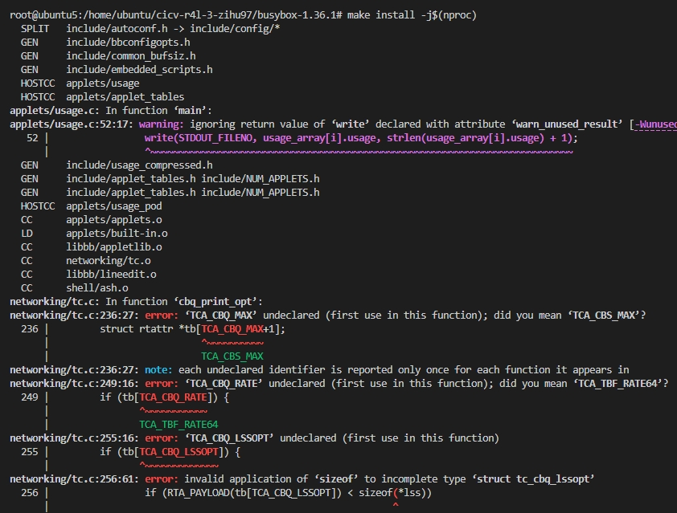
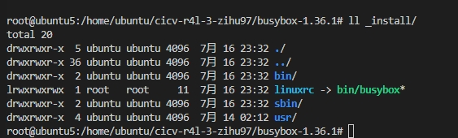
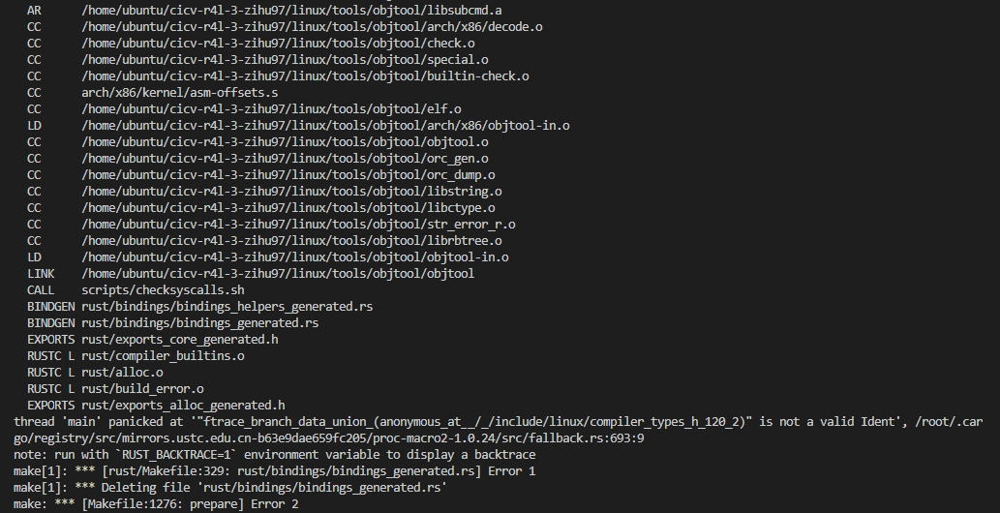
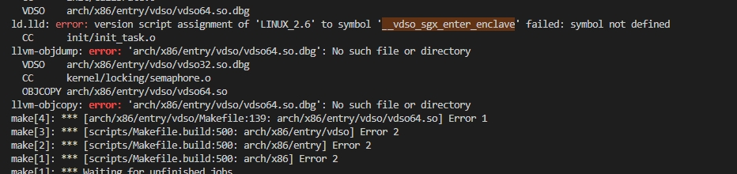

# Building Busybox & Kernel

To build Busybox and the Linux kernel, follow these steps:

## Step 0: Install Ubuntu 22.04

我在WINDOWS11上下载了virtual box，然后安装了Ubuntu 22.04。

The following step is in the directory which contains the content of [rust for linux](https://github.com/cicvedu/cicv-r4l-3-zihu97).

## Step 1: Install Required Packages

```bash
sudo apt-get update
sudo apt-get install build-essential ncurses-dev bison flex bc
sudo apt install git curl

sudo apt install build-essential libtool texinfo gzip zip unzip patchutils cmake ninja-build automake bison flex gperf grep sed gawk bc zlib1g-dev libexpat1-dev libmpc-dev libncurses-dev libglib2.0-dev libfdt-dev libpixman-1-dev libelf-dev libssl-dev

sudo apt-get install clang-format clang-tidy clang-tools clang clangd libc++-dev libc++1 libc++abi-dev libc++abi1 libclang-dev libclang1 liblldb-dev libllvm-ocaml-dev libomp-dev libomp5 lld lldb llvm python3-clang
```

## Step 2: Install Rust

参考[Rust开发环境配置](https://rcore-os.cn/arceos-tutorial-book/ch01-02.html)安装Rust

```bash
# vi ~/.cargo/config.toml

[source.crates-io]
replace-with = 'tuna'

[source.tuna]
registry = "https://mirrors.tuna.tsinghua.edu.cn/git/crates.io-index.git"
```

## Step 3: Build Busybox

```bash
# 可从官网下载源代码
# wget https://busybox.net/downloads/busybox-1.36.1.tar.bz2
# tar -xjvf busybox-1.36.1.tar.bz2
# 进入源代码目录
cd busybox-1.36.1
# 启动menuconfig进行配置
make menuconfig
# 在Settings项中，将"Build static binary (no shared libs)"选中
Settings
          ---> [*] Build static binary (no shared libs)
# 退出
make install -j$(nproc)
```

编译时发现如下报错：



解决办法可参考[Disable CBQ](https://www.reddit.com/r/linuxquestions/comments/1cizfpo/id_like_some_help_with_this_youtube_guide/)

```bash
sed -i 's/CONFIG_TC=y/CONFIG_TC=n/g' .config
```

Then obtain the busybox binary in `/mnt/busybox-1.36.1/_install`.



## Step 4: Install qemu

```bash
apt install qemu-system-x86
qemu-system-x86_64 --version
```

## Step 5: Install Linux Kernel Build Essentials

```bash
cd linux
# 将此目录中的rustc重置为特定版本
# 可提前为rustup设置代理，以便加速下载过程，参考上一节“安装Rust”中的说明
rustup override set $(scripts/min-tool-version.sh rustc)
# 添加rust-src源代码
rustup component add rust-src
# 安装clang llvm，该项一般在配置内核时已经安装，若已安装此处可忽略
apt install clang llvm

# 可为cargo仓库crates.io设置使用镜像，参考上一节“安装Rust”中的说明
# 安装bindgen工具，注意在0.60版本后，bindgen工具的命令行版本位于bindgen-cli包中
cargo install --locked --version $(scripts/min-tool-version.sh bindgen) bindgen
# 安装rustfmt和clippy
rustup component add rustfmt
rustup component add clippy
# 检查内核rust支持已经启用
make LLVM=1 rustavailable
```

## Step 6: Build Linux Kernel

```bash
make x86_64_defconfig
make LLVM=1 menuconfig
#set the following config to yes
General setup
        ---> [*] Rust support
make LLVM=1 -j$(nproc)
```

### 6.1: Compile Error1

编译时发现如下报错：
thread 'main' panicked at '"ftrace_branch_data_union_(anonymous_at__/_/include/linux/compiler_types_h_120_2)" is not a valid Ident', /root/.cargo/registry/src/mirrors.ustc.edu.cn-b63e9dae659fc205/proc-macro2-1.0.24/src/fallback.rs:693:9



解决办法可参考[modify bindgen](https://github.com/rust-lang/rust-bindgen/pull/2316)

```bash
# 从报错信息中找到bindgen目录
cd /root/.cargo/registry/src/mirrors.ustc.edu.cn-b63e9dae659fc205/bindgen-0.56.0/
# modify
# rebuild and install
cargo install --path .
```

### 6.2: Compile Error2

继续编译还发现如下报错：
ld.lld: error: version script assignment of 'LINUX_2.6' to symbol '__vdso_sgx_enter_enclave' failed: symbol not defined



解决办法可参考[modify kernel](https://lkml.org/lkml/2022/11/8/1236)

```bash
cd linux
vi arch/x86/entry/vdso/vdso.lds.S
```

Then obtain the kernel binary in `linux/arch/x86/boot/bzImage` and kernel image in `linux/arch/x86/boot/compressed/vmlinux`.
