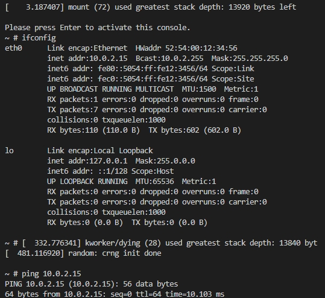
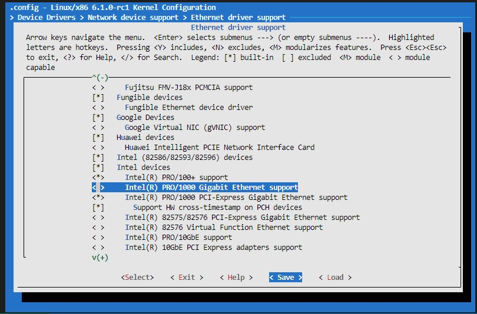

# Build Linux Bootable Image & Setup Network

## Questions & Answers

## Questions

在该文件夹中调用make LLVM=1，该文件夹内的代码将编译成一个内核模块。请结合你学到的知识，回答以下两个问题：
1、编译成内核模块，是在哪个文件中以哪条语句定义的？
2、该模块位于独立的文件夹内，却能编译成Linux内核模块，这叫做out-of-tree module，请分析它是如何与内核代码产生联系的？

## Answers

1. 
Makefile调用kbuild，-m表示编译成内核模块
```
obj-m := r4l_e1000_demo.o
```

2. 
Makefile 使用 kbuild 系统构建模块，确保模块与特定内核版本兼容。-C指定当前运行内核的构建配置和符号

## Step 0: Setup Environment

Before doing this you should have done everything in [this section](./01-busybox-kernel.md) and have entered the Ubuntu environment.

## Step 1: Install Dependencies

```bash
sudo apt-get update
sudo apt-get install -y cpio
```

## Step 2: Build Linux Bootable Image & Bootstrap

```bash
cd src_e1000
bash build_image.sh
```
一开始发现使用qemu但是始终没有看到有什么输出，后来群里大佬给出了原因：我使用的clang版本过高(clang-18)，使用clang-14可以成功运行。

后来安装了clang-14但是发现还有其他依赖的库也要相对应的版本，后来借助[xforcevesa大佬的容器方法](https://github.com/cicvedu/cicv-r4l-3-xforcevesa/blob/master/docs/01-busybox-kernel.md)全安装

这里面还有个注意点是：使用ubuntu自带的镜像源，不要使用清华的镜像源，这样就不会出现各种版本过高不匹配的问题，貌似也不会遇到01中遇到的各种hack的方式

另外还有个注意点：如果遇到bindgen找不到0.56.0，那么就需要配置~/.cargo/config.toml





## Step 3: Configure Network

After entering the QEMU Linux tty, do this:

```bash
insmod r4l_e1000_demo.ko
ip link set eth0 up
ip addr add broadcast 10.0.2.255 dev eth0
ip addr add 10.0.2.15/255.255.255.0 dev eth0 
ip route add default via 10.0.2.1
ping 10.0.2.2
```


```
~ # insmod r4l_e1000_demo.ko
[   26.056302] r4l_e1000_demo: loading out-of-tree module taints kernel.
[   26.070944] r4l_e1000_demo: Rust for linux e1000 driver demo (init)
[   26.072289] r4l_e1000_demo: Rust for linux e1000 driver demo (probe): None
[   26.307972] ACPI: \_SB_.LNKC: Enabled at IRQ 11
[   26.332837] r4l_e1000_demo: Rust for linux e1000 driver demo (net device get_stats64)
[   26.338985] insmod (81) used greatest stack depth: 11192 bytes left
~ # ip link set eth0 up
[   33.597322] r4l_e1000_demo: Rust for linux e1000 driver demo (net device open)
[   33.601484] r4l_e1000_demo: Rust for linux e1000 driver demo (net device get_stats64)
[   33.603174] IPv6: ADDRCONF(NETDEV_CHANGE): eth0: link becomes ready
~ # [   33.612325] r4l_e1000_demo: Rust for linux e1000 driver demo (net device get_stats64)
[   33.620166] r4l_e1000_demo: Rust for linux e1000 driver demo (net device start_xmit) tdt=0, tdh=0, rdt=7, rdh=0
[   33.620927] r4l_e1000_demo: Rust for linux e1000 driver demo (handle_irq)
[   33.621400] r4l_e1000_demo: pending_irqs: 3
[   33.622512] r4l_e1000_demo: Rust for linux e1000 driver demo (napi poll)
[   34.334914] r4l_e1000_demo: Rust for linux e1000 driver demo (net device start_xmit) tdt=1, tdh=1, rdt=7, rdh=0
[   34.336356] r4l_e1000_demo: Rust for linux e1000 driver demo (handle_irq)
[   34.337468] r4l_e1000_demo: pending_irqs: 3
[   34.343239] r4l_e1000_demo: Rust for linux e1000 driver demo (napi poll)
[   34.547353] r4l_e1000_demo: Rust for linux e1000 driver demo (net device start_xmit) tdt=2, tdh=2, rdt=7, rdh=0
[   34.549180] r4l_e1000_demo: Rust for linux e1000 driver demo (handle_irq)
[   34.549684] r4l_e1000_demo: pending_irqs: 3
[   34.550860] r4l_e1000_demo: Rust for linux e1000 driver demo (napi poll)
[   35.360658] r4l_e1000_demo: Rust for linux e1000 driver demo (net device start_xmit) tdt=3, tdh=3, rdt=7, rdh=0
[   35.360899] r4l_e1000_demo: Rust for linux e1000 driver demo (handle_irq)
[   35.361262] r4l_e1000_demo: pending_irqs: 3
[   35.361381] r4l_e1000_demo: Rust for linux e1000 driver demo (napi poll)
[   35.361833] r4l_e1000_demo: Rust for linux e1000 driver demo (net device start_xmit) tdt=4, tdh=4, rdt=7, rdh=0
[   35.363207] r4l_e1000_demo: Rust for linux e1000 driver demo (handle_irq)
[   35.363767] r4l_e1000_demo: pending_irqs: 3
[   35.364092] r4l_e1000_demo: Rust for linux e1000 driver demo (napi poll)
[   36.126755] r4l_e1000_demo: Rust for linux e1000 driver demo (net device start_xmit) tdt=5, tdh=5, rdt=7, rdh=0
[   36.127329] r4l_e1000_demo: Rust for linux e1000 driver demo (handle_irq)
[   36.127404] r4l_e1000_demo: pending_irqs: 3
[   36.127469] r4l_e1000_demo: Rust for linux e1000 driver demo (napi poll)
[   39.206465] r4l_e1000_demo: Rust for linux e1000 driver demo (net device start_xmit) tdt=6, tdh=6, rdt=7, rdh=0
[   39.206929] r4l_e1000_demo: Rust for linux e1000 driver demo (handle_irq)
[   39.207233] r4l_e1000_demo: pending_irqs: 3
[   39.207730] r4l_e1000_demo: Rust for linux e1000 driver demo (napi poll)
[   47.205837] r4l_e1000_demo: Rust for linux e1000 driver demo (net device start_xmit) tdt=7, tdh=7, rdt=7, rdh=0
[   47.207098] r4l_e1000_demo: Rust for linux e1000 driver demo (handle_irq)
[   47.207686] r4l_e1000_demo: pending_irqs: 3
[   47.208086] r4l_e1000_demo: Rust for linux e1000 driver demo (napi poll)

~ # ip addr add broadcast 10.0.2.255 dev eth0
[   52.343064] r4l_e1000_demo: Rust for linux e1000 driver demo (net device get_stats64)
[   52.346961] r4l_e1000_demo: Rust for linux e1000 driver demo (net device get_stats64)
ip: RTNETLINK answers: Invalid argument
~ # ip addr add 10.0.2.15/255.255.255.0 dev eth0
[   59.062084] r4l_e1000_demo: Rust for linux e1000 driver demo (net device get_stats64)
[   59.062520] r4l_e1000_demo: Rust for linux e1000 driver demo (net device get_stats64)
~ # [   62.581678] r4l_e1000_demo: Rust for linux e1000 driver demo (net device start_xmit) tdt=0, tdh=0, rdt=7, 0
[   62.582335] r4l_e1000_demo: Rust for linux e1000 driver demo (handle_irq)
[   62.582778] r4l_e1000_demo: pending_irqs: 3
[   62.583302] r4l_e1000_demo: Rust for linux e1000 driver demo (napi poll)

~ # ip route add default via 10.0.2.1
~ # ping 10.0.2.2
PING 10.0.2.2 (10.0.2.2): 56 data bytes
[   69.123973] r4l_e1000_demo: Rust for linux e1000 driver demo (net device start_xmit) tdt=1, tdh=1, rdt=7, rdh=0
[   69.124661] r4l_e1000_demo: Rust for linux e1000 driver demo (handle_irq)
[   69.124754] r4l_e1000_demo: pending_irqs: 131
[   69.125346] r4l_e1000_demo: Rust for linux e1000 driver demo (napi poll)
[   69.128593] r4l_e1000_demo: Rust for linux e1000 driver demo (net device start_xmit) tdt=2, tdh=2, rdt=0, rdh=1
[   69.129432] r4l_e1000_demo: Rust for linux e1000 driver demo (handle_irq)
[   69.129608] r4l_e1000_demo: pending_irqs: 131
[   69.131496] r4l_e1000_demo: Rust for linux e1000 driver demo (napi poll)
64 bytes from 10.0.2.2: seq=0 ttl=255 time=17.271 ms
[   70.142053] r4l_e1000_demo: Rust for linux e1000 driver demo (net device start_xmit) tdt=3, tdh=3, rdt=1, rdh=2
[   70.142846] r4l_e1000_demo: Rust for linux e1000 driver demo (handle_irq)
[   70.143092] r4l_e1000_demo: pending_irqs: 131
[   70.143290] r4l_e1000_demo: Rust for linux e1000 driver demo (napi poll)
64 bytes from 10.0.2.2: seq=1 ttl=255 time=2.026 ms
[   71.156603] r4l_e1000_demo: Rust for linux e1000 driver demo (net device start_xmit) tdt=4, tdh=4, rdt=2, rdh=3
[   71.158434] r4l_e1000_demo: Rust for linux e1000 driver demo (handle_irq)
[   71.158742] r4l_e1000_demo: pending_irqs: 131
[   71.159396] r4l_e1000_demo: Rust for linux e1000 driver demo (napi poll)
64 bytes from 10.0.2.2: seq=2 ttl=255 time=4.952 ms
[   72.167755] r4l_e1000_demo: Rust for linux e1000 driver demo (net device start_xmit) tdt=5, tdh=5, rdt=3, rdh=4
[   72.168082] r4l_e1000_demo: Rust for linux e1000 driver demo (handle_irq)
[   72.168222] r4l_e1000_demo: pending_irqs: 131
[   72.168565] r4l_e1000_demo: Rust for linux e1000 driver demo (napi poll)
64 bytes from 10.0.2.2: seq=3 ttl=255 time=1.667 ms
^C
--- 10.0.2.2 ping statistics ---
4 packets transmitted, 4 packets received, 0% packet loss
round-trip min/avg/max = 1.667/6.479/17.271 ms
~ # [   91.786018] r4l_e1000_demo: Rust for linux e1000 driver demo (net device start_xmit) tdt=6, tdh=6, rdt=4, 5
[   91.788182] r4l_e1000_demo: Rust for linux e1000 driver demo (handle_irq)
[   91.788810] r4l_e1000_demo: pending_irqs: 3
[   91.789833] r4l_e1000_demo: Rust for linux e1000 driver demo (napi poll)

~ # ifconfig
[   96.929155] r4l_e1000_demo: Rust for linux e1000 driver demo (net device get_stats64)
eth0      Link encap:Ethernet  HWaddr 52:54:00:12:34:56  
          inet addr:10.0.2.15  Bcast:0.0.0.0  Mask:255.255.255.0
          inet6 addr: fe80::5054:ff:fe12:3456/64 Scope:Link
          UP BROADCAST RUNNING MULTICAST  MTU:1500  Metric:1
          RX packets:0 errors:0 dropped:0 overruns:0 frame:0
          TX packets:0 errors:0 dropped:0 overruns:0 carrier:0
          collisions:0 txqueuelen:1000 
          RX bytes:0 (0.0 B)  TX bytes:0 (0.0 B)

~ # 
```

## Step 4: Exit QEMU

You can exit the QEMU Linux tty by pressing `Ctrl-A X`.