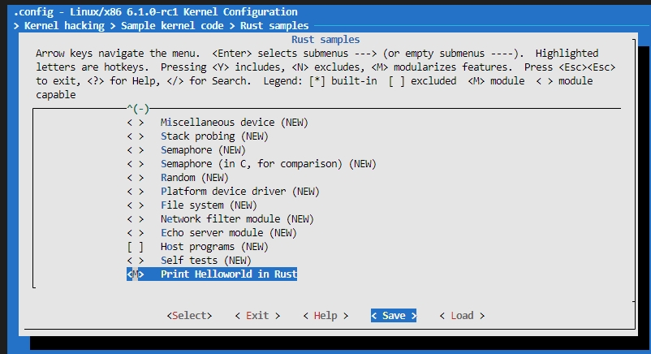
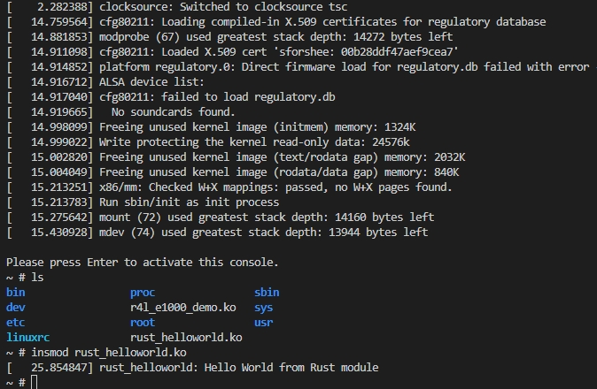

# Hack the Kernel using Rust

This section will guide you through the process of hacking the Linux kernel using Rust.

## Step 1: Write Hacking Code

Add a file at `linux/samples/rust/rust_helloworld.rs` with the following code:

```rust
// SPDX-License-Identifier: GPL-2.0
//! Rust minimal sample.
      
use kernel::prelude::*;
      
module! {
  type: RustHelloWorld,
  name: "rust_helloworld",
  author: "whocare",
  description: "hello world module in rust",
  license: "GPL",
}
      
struct RustHelloWorld {}
      
impl kernel::Module for RustHelloWorld {
  fn init(_name: &'static CStr, _module: &'static ThisModule) -> Result<Self> {
      pr_err!("Hello World from Rust module");
      Ok(RustHelloWorld {})
  }
}
```


## Step 2: Configure the Module

Add the following content to `linux/sample/rust/Kconfig`, above the line `endif # SAMPLES_RUST`:

```bash
config SAMPLE_RUST_HELLOWORLD
        tristate "Print Helloworld in Rust"
        help
          This option builds the helloworld case for Rust.

          If unsure, say N.
```

Add the following content to `linux/sample/rust/Makefile`:

```makefile
obj-$(CONFIG_SAMPLE_RUST_HELLOWORLD)            += rust_helloworld.o
```

## Step 3: Build the Kernel


```bash
make LLVM=1 -j$(nproc)
```

## Step 4: Copy the Module

```bash
cd ../src_e1000/
bash build_image.sh
# 退出QEMU
cp ../linux/samples/rust/rust_helloworld.ko ./rootfs
```

## Step 5: Run the Module

```bash
bash build_image.sh
```

In QEMU Linux tty:

```bash
ls
insmod rust_helloworld.ko
```

